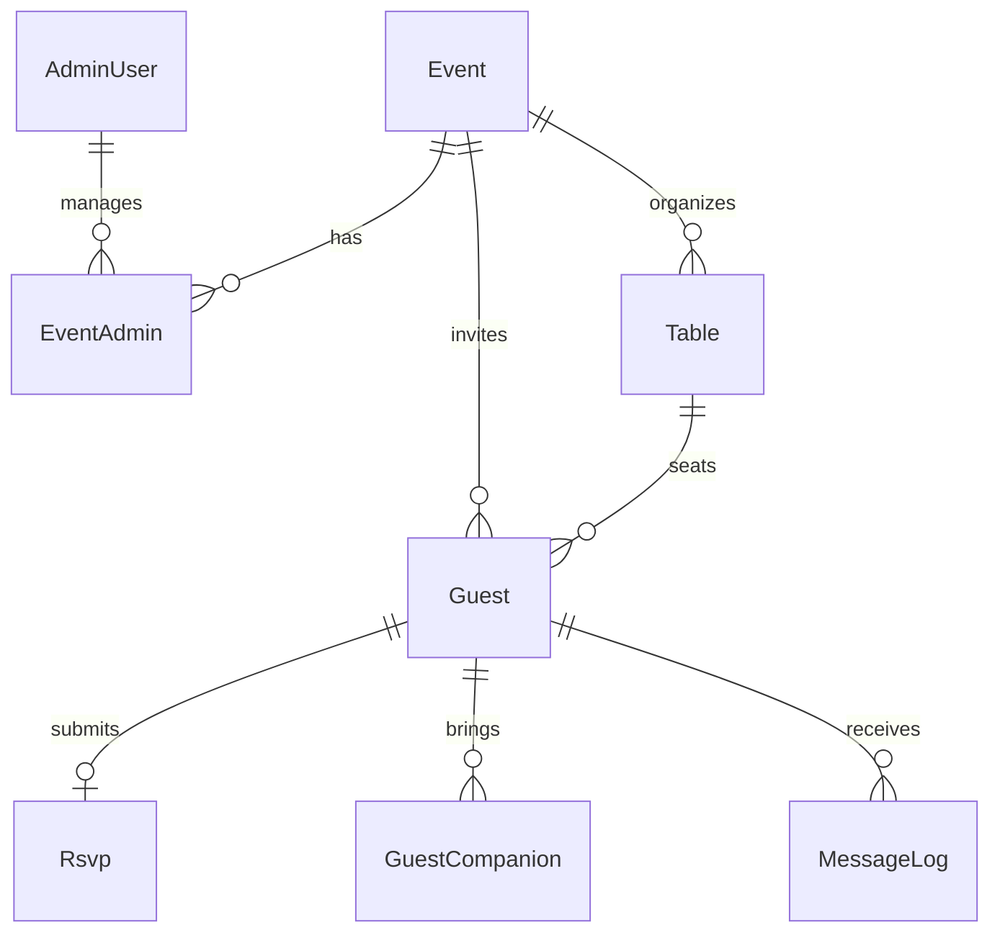

# Database Schema

The Invitation App uses **PostgreSQL** with **Prisma ORM**. The schema is designed to handle multiple events and granular guest management.

## Core Models

### 1. User & Access Control
- **`AdminUser`**: Central user account for management.
  - `isSuperAdmin`: Determines if the user has access to the `/super` dashboard (all events).
- **`EventAdmin`**: A join table linking `AdminUser` to specific `Event`s. This allows an admin to manage one or more specific events without having global access.

### 2. Events
- **`Event`**: Stores all configuration for an event.
  - Branding: Colors, fonts, hero images, and background styles.
  - Program: JSON field containing a timeline of activities.
  - Gift List: JSON field for gift registry items.
  - RSVP Fields: JSON field to toggle specific form fields (dietary, transport, etc.).

### 3. Guests & RSVP
- **`Guest`**: Represents an invited entity (can be an individual or a family/couple).
  - `token`: A unique UUID/token used for the guest's personalized RSVP link.
  - `maxAllowed`: Maximum number of people (companions + primary guest) allowed for this invitation.
  - `rsvpStatus`: Enum (`PENDING`, `ATTENDING`, `DECLINED`, `MAYBE`).
- **`Rsvp`**: Created when a guest submits the form.
  - Linked 1:1 with `Guest`.
  - Captures `totalAttending`, dietary restrictions, and personal messages.
- **`GuestCompanion`**: Specific details for each companion attending with the primary guest.

### 4. Logistics
- **`Table`**: Defines seating arrangements.
  - Linked to an `Event`.
  - `Guest`s are assigned to a `Table` via `tableId`.
- **`MessageLog`**: Tracks communications sent to guests.
  - Records channel (Email, WhatsApp, etc.), status, and any errors.

## Enums

- **`ContactMethod`**: `EMAIL`, `WHATSAPP`, `SMS`, `MANUAL`.
- **`RsvpStatus`**: `PENDING`, `ATTENDING`, `DECLINED`, `MAYBE`.
- **`MessageType`**: `INVITATION`, `REMINDER`, `CONFIRMATION`, `CUSTOM`.
- **`DeliveryStatus`**: `SENT`, `DELIVERED`, `FAILED`, `PENDING`.

## Entity Relationship Summary

